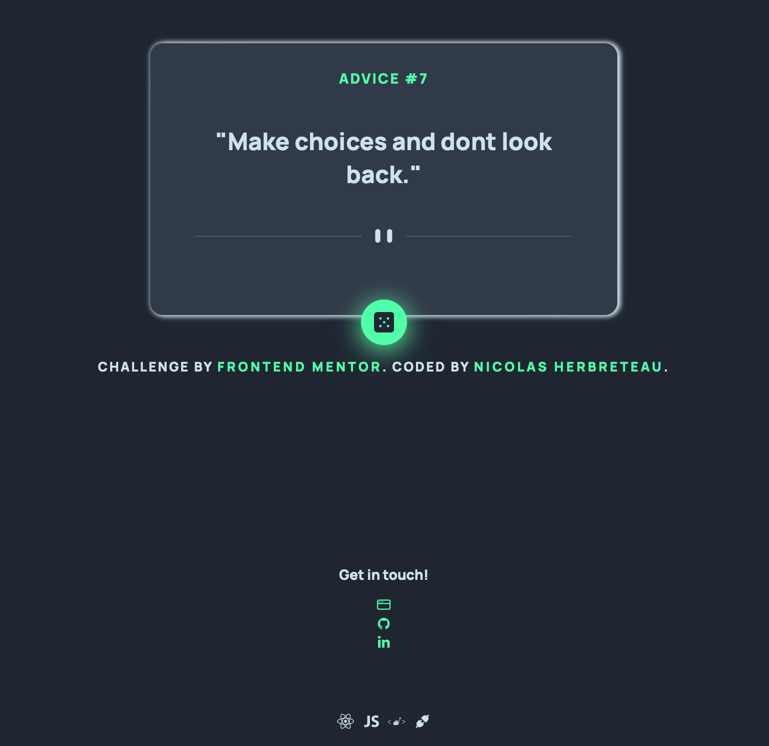

# Advice generator App 🎲

## Table of contents

- [Overview](#overview)
    - [Screenshot](#screenshot)
- [Built with](#built-with)
- [Link](#link)
- [Contact](#contact)

## Overview
Users should be able to:

- View the optimal layout for the app depending on their device's screen size
- See hover states for all interactive elements on the page
- Generate a new piece of advice by clicking the dice icon

### Screenshot

## Built with
- [React](https://reactjs.org/) - JS library
- [Styled Components](https://styled-components.com/) - For styles

## Link
- [Live version](https://nico-dev-it.github.io/advice-generator/)

## Contact
💼 [Website](https://nicolas-herbreteau.com)

